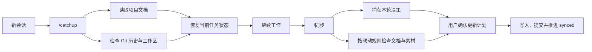

# Project Consistency Kit

> 一套面向长期 AI Agent 协作的项目一致性机制。它用 Git 记录项目变化，通过 `/catchup` 恢复跨会话状态，再用 `/同步` 检查文档联动、完成本地提交并推进同步边界。

[](LICENSE)

## 为什么做这个项目

长期和 AI Agent 一起维护项目时，问题通常不在单次生成，而在会话之间：新会话不知道上次做到哪里，代码或内容已经变化，README、决策记录和素材清单却还停在旧状态。

Project Consistency Kit 把这些状态交给仓库本身管理。Git 负责记录已发生的变化，项目文档负责保存背景和规则，`synced` 标签标记上一次完成联动检查的位置。Agent 可以据此恢复工作，也能在收尾时找到可能遗漏的文档更新。

## 工作方式



`/catchup` 只读取和汇报，不修改文件。`/同步` 会先展示联动计划和待提交范围，获得确认后才写入文件或提交；它不会自动推送远端。

## 核心能力

- **跨会话恢复**：结合 `CLAUDE.md`、`README.md`、中枢文档、Git 历史和未提交文件，识别已经完成、正在进行和待决策的工作。
- **同步边界**：用独立的 `synced` 标签记录上次完成联动检查的位置，手工提交过但尚未同步的改动也不会被跳过。
- **文件联动检查**：在 `一致性机制/文件联动目录.md` 中声明中枢文档和项目规则，改动发生后检查相关说明、决策记录和素材清单是否需要更新。
- **对话决策落盘**：收尾时回看当前会话，将尚未进入文件的决策、约定和对接结果列给用户确认。
- **增量接入**：`/引入一致性机制` 会先扫描现有项目，再生成安装计划；已有文件采用追加或合并方式处理，不直接覆盖。
- **收尾提醒**：Stop hook 检测到未同步改动时提醒一次，只提示，不自动修改、提交或推送。
- **二进制资产治理**：可选用 Git LFS 管理栅格图，用 `_manifest.md` 记录设计源、字体和媒体素材的用途、来源与授权信息。

## 快速开始

当前宿主为 Claude Code，需要本机安装 Git。先克隆仓库，并记住它的绝对路径：

```bash
git clone https://github.com/sparkler233/project-consistency-kit.git
cd project-consistency-kit
KIT_DIR="$PWD"
```

### 接入已有项目

把安装命令链接到 Claude Code 的全局命令目录：

```bash
mkdir -p ~/.claude/commands
ln -sfn "$KIT_DIR/.claude/commands/引入一致性机制.md" \
  ~/.claude/commands/引入一致性机制.md
```

随后进入目标项目，在 Claude Code 中运行 `/引入一致性机制`。安装器会扫描项目文档、Git 状态和二进制资产类型，展示计划并等待确认。

安装器会优先从全局命令符号链接反推出套件位置；如果无法定位，才会尝试 `~/Developer/项目一致性机制`，仍找不到时会询问实际路径。

如需通过自然语言触发安装，也可以链接同名 skill：

```bash
mkdir -p ~/.agents/skills
ln -sfn "$KIT_DIR/一致性机制/skills/引入一致性机制" \
  ~/.agents/skills/引入一致性机制
```

### 创建全新项目

全新项目可按 [`初始化新项目.md`](初始化新项目.md) 复制模板并建立首个 `synced` 标签。已有项目不要整包复制，使用增量安装器可以保留原有文件结构。

## 一次典型使用

假设一个内容生产项目刚调整了章节结构，并新增两张图片。工作区里已经有正文和素材改动，但 README 的进度、图片清单和决策记录还没有更新。

1. 新会话运行 `/catchup`，Agent 会读取 Git 状态和相关文件，指出上次停在章节调整与图片接入。
2. 完成工作后运行 `/同步`，机制会根据联动目录提出更新 README、素材清单和决策记录的计划。
3. 用户确认计划与提交范围后，机制执行更新、创建本地提交，并把 `synced` 移到该提交。

更完整的输入和输出示意见 [`docs/example-session.md`](docs/example-session.md)。

## 设计边界

- Git 是事实来源，但对话中的决定只有在当前会话运行 `/同步` 时才能被补写，已经丢失的旧会话内容无法自动恢复。
- 文件联动依赖项目自己的规则质量。安装器会协助发现中枢文档，领域规则仍需要项目维护者确认。
- `synced` 是本地标签，项目按单机流程设计。多机使用时，需要自行同步标签并处理不同设备的基准差异。
- Stop hook 目前通过 Claude Code 的项目设置接入。命令文档和 Shell 脚本可迁移到其他 Agent 宿主，但需要适配对应的命令与 hook 机制。
- `/同步` 不自动推送远端，也不会在未确认时修改文件或创建提交。

## 仓库结构

```text
.
├── .claude/
│   ├── commands/               # /catchup、/同步、/引入一致性机制
│   └── settings.json           # Stop hook 接线
├── 一致性机制/
│   ├── hooks/收尾提醒.sh
│   ├── skills/引入一致性机制/
│   ├── 机制设计说明.md
│   ├── 文件联动目录.md
│   └── 决策档案.md
├── docs/example-session.md     # 使用示例
├── templates/README.md         # 新项目使用的项目地图模板
├── CLAUDE.md                   # 模板项目的背景、规则与决策骨架
├── 初始化新项目.md              # 全新项目接入指南
└── CHANGELOG.md                # 套件版本记录
```

机制设计与取舍见 [`一致性机制/机制设计说明.md`](一致性机制/机制设计说明.md)，版本变化见 [`CHANGELOG.md`](CHANGELOG.md)。

## 许可证

[MIT](LICENSE)
