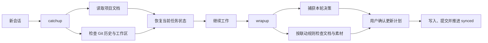

# Project Consistency Kit

> 一套面向长期 AI Agent 协作的项目一致性机制。它用 Git 记录项目变化，通过 catchup 恢复跨会话状态，再用 wrapup 检查文档联动、完成本地提交并推进同步边界。

[](LICENSE)

## 为什么做这个项目

长期和 AI Agent 一起维护项目时，问题通常不在单次生成，而在会话之间：新会话不知道上次做到哪里，代码或内容已经变化，项目状态、决策记录和素材清单却还停在旧状态。

Project Consistency Kit 把这些状态交给仓库本身管理。Git 负责记录已发生的变化，项目文档负责保存背景和规则，`synced` 标签标记上一次完成联动检查的位置。Agent 可以据此恢复工作，也能在收尾时找到可能遗漏的文档更新。

## 工作方式



catchup 只读取和汇报，不修改文件。wrapup 会先展示联动计划和待提交范围，获得确认后才写入文件或提交；它不会自动推送远端。Codex 使用 `$catchup` / `$wrapup` 或自然语言触发，Claude Code 使用 `/catchup` / `/wrapup`。

## 核心能力

- **跨会话恢复**：Agent harness 自动加载 `AGENTS.md` / `CLAUDE.md` 工作规则，仓库级 catchup Skill 再结合 `PROJECT.md`、中枢文档、Git 历史和未提交文件恢复状态。
- **跨 Harness 工作流**：catchup / wrapup 的唯一行为正本位于 `.agents/skills/`；Codex 直接发现，Claude Code 通过薄斜杠命令适配。
- **职责分离**：`PROJECT.md` 保存运行事实，`AGENTS.md` 是 Agent 指令源本，`CLAUDE.md` 仅作为相对链接适配层。
- **同步边界**：用独立的 `synced` 标签记录上次完成联动检查的位置，手工提交过但尚未同步的改动也不会被跳过。
- **文件联动检查**：在 `一致性机制/文件联动目录.md` 中声明中枢文档和项目规则，改动发生后检查相关说明、决策记录和素材清单是否需要更新。
- **对话决策落盘**：收尾时回看当前会话，将尚未进入文件的决策、约定和对接结果列给用户确认。
- **可引导安装**：全局 `project-consistency-installer` Skill 可由 skills.sh 从 GitHub 安装；运行时自动获取套件源、扫描现有 PROJECT / AGENTS / CLAUDE / README，再经确认增量引入。
- **干净发布面**：源码仓库可以继续用本机制维护自己；`v*` 标签生成的 Release 只包含逐文件白名单批准的通用产品，并携带来源与 SHA-256 校验。
- **收尾提醒**：Stop hook 检测到未同步改动时提醒一次，只提示，不自动修改、提交或推送。
- **二进制资产治理**：可选用 Git LFS 管理栅格图，用 `_manifest.md` 记录设计源、字体和媒体素材的用途、来源与授权信息。

## 快速开始

支持 Codex、Claude Code 及兼容 `AGENTS.md` / Agent Skills 的 Harness，需要本机安装 Git 和 Node.js；Release 获取与校验还需要 `curl`、`tar` 以及 `sha256sum` 或 `shasum`。

### 接入已有项目

通过 skills.sh 将安装器装到用户级 Skill 目录：

```bash
npx skills add sparkler233/project-consistency-kit \
  --skill project-consistency-installer \
  --global
```

CLI 会自动检测可用的 Harness，必要时让你选择；也可以用 `--agent codex` 或 `--agent claude-code` 显式指定。安装完成后，进入目标项目，直接告诉 Agent：

> 给这个项目引入一致性机制。

支持显式 Skill 调用的 Harness，也可以通过各自的 Skill 选择方式调用 `project-consistency-installer`。具体入口由 Harness 决定。

安装器会优先使用用户明确提供的本地套件；找不到时，下载最新的干净 GitHub Release 到机器缓存，验证外层压缩包、内部逐文件清单、规范来源和 source commit 后再展示项目迁移计划。下载阶段不修改目标项目，写入仍需单独确认。

### 干净发布包

本仓库 `main` 是源码与自举面，因此会包含维护套件自身所需的 `PROJECT.md`、`AGENTS.md`、`CLAUDE.md`、真实联动规则和决策档案；它不是可直接整包复制的项目模板。

`v*` 标签会通过 GitHub Actions 生成 `project-consistency-kit.tar.gz` 和对应 `.sha256`。Release 包只包含 [源码仓库分发白名单](https://github.com/sparkler233/project-consistency-kit/blob/main/distribution/manifest.txt) 明确列出的产品文件，并额外生成来源元数据与内部逐文件校验清单。需要手工下载时可从 [GitHub Releases](https://github.com/sparkler233/project-consistency-kit/releases) 获取；通常直接使用安装器即可。

### 本地开发接线

维护套件或需要离线使用时，可以先 clone，再把本地安装器 Skill 链接到用户目录：

```bash
git clone https://github.com/sparkler233/project-consistency-kit.git
cd project-consistency-kit
KIT_DIR="$PWD"

mkdir -p ~/.agents/skills
ln -sfn "$KIT_DIR/skills/project-consistency-installer" \
  ~/.agents/skills/project-consistency-installer

mkdir -p ~/.claude/commands
ln -sfn "$KIT_DIR/.claude/commands/引入一致性机制.md" \
  ~/.claude/commands/引入一致性机制.md
```

Claude Code 的 `/引入一致性机制` 只是兼容适配器；安装行为正本仍是同一个 `project-consistency-installer` Skill。套件目录迁移后需要重建这两条本地开发链接。

### 创建全新项目

全新项目优先解压干净 Release，再按 [`初始化新项目.md`](初始化新项目.md) 复制模板并建立首个 `synced` 标签；本地开发时也可显式使用源码 checkout。已有项目不要整包复制，使用增量安装器可以保留原有文件结构。

## 一次典型使用

假设一个内容生产项目刚调整了章节结构，并新增两张图片。工作区里已经有正文和素材改动，但 PROJECT 的进度、图片清单和决策记录还没有更新。

1. 新会话执行 catchup（Codex：`$catchup`；Claude Code：`/catchup`），Agent 会读取 Git 状态和相关文件，指出上次停在章节调整与图片接入。
2. 完成工作后执行 wrapup（Codex：`$wrapup`；Claude Code：`/wrapup`），机制会根据联动目录提出更新 PROJECT、素材清单和决策记录的计划；README 只有承载受影响的公开契约时才联动。
3. 用户确认计划与提交范围后，机制执行更新、创建本地提交，并把 `synced` 移到该提交。

更完整的输入和输出示意见 [`docs/example-session.md`](docs/example-session.md)。

## 设计边界

- Git 是事实来源，但对话中的决定只有在当前会话执行 wrapup 时才能被补写，已经丢失的旧会话内容无法自动恢复。
- 文件联动依赖项目自己的规则质量。安装器会协助发现中枢文档，领域规则仍需要项目维护者确认。
- `synced` 是本地标签，项目按单机流程设计。多机使用时，需要自行同步标签并处理不同设备的基准差异。
- Stop hook 目前通过 Claude Code 的项目设置接入；catchup / wrapup 已通过仓库级 Skill 适配 Codex，其他 Harness 取决于其 Agent Skills 支持。
- skills.sh 只分发全局安装器 Skill；PROJECT、AGENTS、hooks 和两个仓库级 Skill 由安装器从经验证的干净 GitHub Release 增量写入。默认使用 latest，也可用 `--release <v-tag>` 固定版本；校验失败不会静默回退到源码 `main`。
- `CLAUDE.md -> AGENTS.md` 当前按仓库内相对符号链接设计并已在 macOS/Codex 验证；Windows checkout 与 harness 行为尚待单独测试。
- wrapup 不自动推送远端，也不会在未确认时修改文件或创建提交。

## 源码仓库结构

```text
.
├── .agents/skills/
│   ├── catchup/               # 跨 Harness 入向工作流正本
│   └── wrapup/                # 跨 Harness 出向工作流正本
├── .claude/
│   ├── commands/               # Claude Code 薄适配器 + /引入一致性机制
│   └── settings.json           # Stop hook 接线
├── .github/workflows/
│   └── distribution.yml        # 验证构建；v* 标签发布干净 Release
├── distribution/
│   └── manifest.txt            # 干净分发包逐文件白名单
├── scripts/
│   ├── build-distribution.sh   # 构建目录、tar.gz 与外层校验
│   └── verify-distribution.sh  # 验证文件边界、来源与内部校验
├── skills/
│   └── project-consistency-installer/ # skills.sh 可分发的机器级安装器
├── 一致性机制/
│   ├── hooks/收尾提醒.sh
│   ├── 机制设计说明.md
│   ├── 文件联动目录.md         # 套件源码面真实规则（不进 Release）
│   └── 决策档案.md             # 套件源码面真实历史（不进 Release）
├── docs/example-session.md     # 使用示例
├── templates/
│   ├── PROJECT.md              # 新项目使用的事实与地图模板
│   ├── AGENTS.md               # 新项目使用的 Agent 规则模板
│   └── 一致性机制/
│       ├── 文件联动目录.md      # 新项目使用的联动规则模板
│       └── 决策档案.md          # 新项目使用的空白决策档案
├── PROJECT.md                  # 套件源码面自身事实（不进 Release）
├── AGENTS.md                   # 套件源码面指令正本（不进 Release）
├── CLAUDE.md -> AGENTS.md      # 套件源码面适配链接（不进 Release）
├── 初始化新项目.md              # 全新项目接入指南
└── CHANGELOG.md                # 套件版本记录
```

机制设计与取舍见 [`一致性机制/机制设计说明.md`](一致性机制/机制设计说明.md)，版本变化见 [`CHANGELOG.md`](CHANGELOG.md)。

## 许可证

[MIT](LICENSE)
